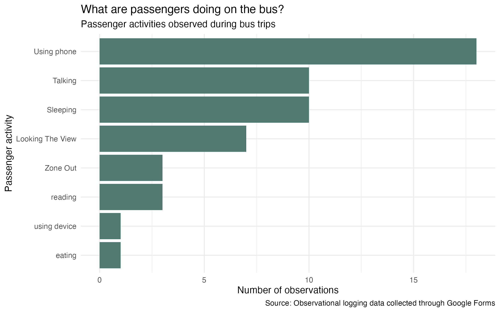
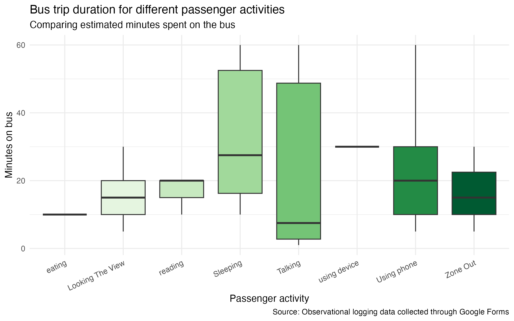
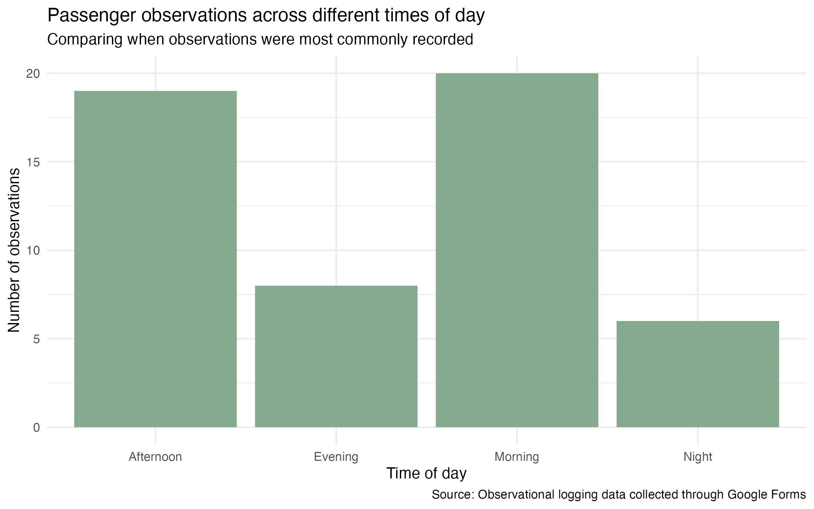

<script src="https://code.jquery.com/jquery-3.7.1.min.js" integrity="sha256-/JqT3SQfawRcv/BIHPThkBvs0OEvtFFmqPF/lYI/Cxo=" crossorigin="anonymous"></script>

```{r setup, include=FALSE}
knitr::opts_chunk$set(echo=FALSE, message=FALSE, warning=FALSE, error=FALSE)
```

```{css, echo=FALSE}
body {
  background-color: #EEF3EF;
  color: #2F3E46;
  font-family: "Helvetica", sans-serif;
}

h1 {
  color: #354F52;
  text-align: center;
  font-size: 42px;
}

h2 {
  color: #52796F;
  margin-top: 80px;
}

img {
  border-radius: 12px;
  margin-top: 20px;
  margin-bottom: 20px;
}
```

```{js}
$(function() {
  $(".level2").css('visibility', 'hidden');
  $(".level2").first().css('visibility', 'visible');
  $(".container-fluid").height($(".container-fluid").height() + 300);
  $(window).on('scroll', function() {
    $('h2').each(function() {
      var h2Top = $(this).offset().top - $(window).scrollTop();
      var windowHeight = $(window).height();
      if (h2Top >= 0 && h2Top <= windowHeight / 2) {
        $(this).parent('div').css('visibility', 'visible');
      } else if (h2Top > windowHeight / 2) {
        $(this).parent('div').css('visibility', 'hidden');
      }
    });
  });
})
```

```{css}
.figcaption {display: none}
```

## Introduction

This visual data story explores how passengers spend their time on the bus. The data was collected through observational logging using a Google Form. Each observation recorded what a passenger was doing, whether they were wearing headphones, the estimated length of their bus trip, and the time of day.

## What passengers were doing

The first visualisation shows the most common passenger activities observed during bus trips. This helps show which behaviours were most typical in the data.



## Trip duration and passenger activity

The second visualisation compares estimated bus trip duration across different passenger activities. This helps show whether some activities were more common during longer or shorter trips.



## Time of day

The final visualisation shows when observations were most commonly recorded. This gives context for the data collection and helps explain when passenger behaviours were observed.



## Overall story

Overall, the data suggests that bus passengers often use travel time for quiet individual activities, especially using phones, sleeping, or wearing headphones. The observations also show that passenger behaviour can vary depending on the length of the trip and the time of day.